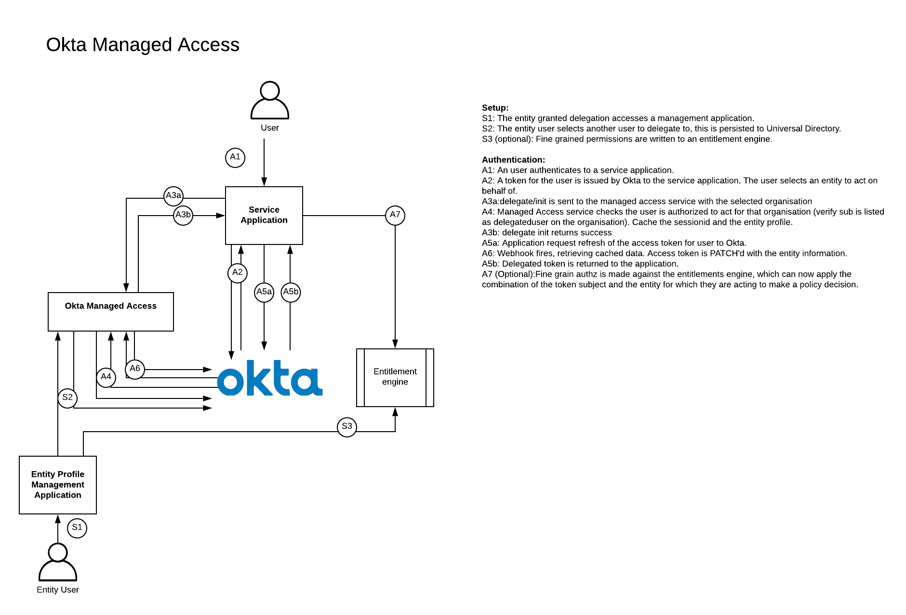

# Okta Managed Access

This demonstration allows you to delegate authority to another user within Okta.
The delegation of authority means that the user exercising the delegated
authority can extend their id and access tokens with the information contained
within the first user's profile.

## Architecture

This demonstration takes advantage of the Early Access feature "user types" to
create an "entity user" type which contains an additional profile attribute
which lists all the users which can exercise the authority of that entity. This
attribute could be applied globally to allow this behaviour on any account.

This project extends the architecture described in [Zee Khoo's Okta Delegate]
(https://github.com/zeekhoo-okta/oktadelegate) but removes the need for the
user exercising delegated priviledges to be a group admin of the target merely
nominated by them.

This architecture ensures that tokens always reflect the user for whom they
describe but enrich the tokens with data of the entity that user represents. All
delegation events pass through a signle point in the architecture which allows
for better audit. Finally only applications which are explicitly configured to
use an authorization server access policy with the delegation inline hook
enabled are able to be delegated.




## Endpoints

### /entity

GET entity/agents?id=<entityid> - return all delegated agents for the given entityid, returns
  error if the user is not an entity.

POST entity/agents?id=<entityid>>&agentid=<agentid> - add the given agentid to the list of delegated
agents on user.

DELETE entity/agents?id=<entityid>>&agentid=<agentid> - removes the given agentid from the list of delegated
agents on user.

### /agent

GET agent?id=<agentid> - list all entities which delegate to this userid

POST agent?id=<agentid> - begin delegation for this user. Must include a JSON
body of 
```
{
    entityid: entityIdentifier,
    sessionid: sessionIdentifier
}
```

## Deploying the demo

### Hosted instance

A hosted version of this demo is running on Heroku
[here](https://okta-managed-access-service.herokuapp.com/).

### Self hosted

#### Application setup

- Clone this repository
- Create a .env file with the following content
```
TENANT=https://<yourtenant>
TOKEN=<your api token>
ENTITY_TYPE_ID=<id of the entity user type>
PORT=5000
AUTHZ_KEY=<a value>
```
- Host the service at a public address

#### Tenant setup

- Enable the user types EA program.
- Create a new user type of entity.
- Add the required profile string attributes for entity of "entityId" and
  "entityName".
- Add the profile string array attribute of "delegated Agents".
- Create a custom authorization server with the following custom claims:
    - entity_id : access token : always : (user.entityId != null) ?
      user.entityId : null
    - entity_name: id token : always : (user.entityName != null) ?
      user.entityName : null
    - can_delegate : access token: always : (user.entityId != null) ? "True" :
      "False"
- Add an inline token hook pointing to https://<your hosted
  instance>/tokenEnrichment/agent
- Create an access policy for your application which calls the token inline hook.